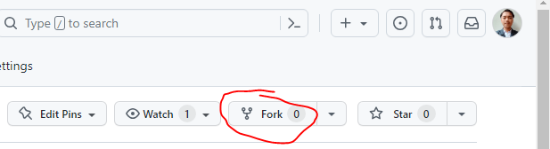
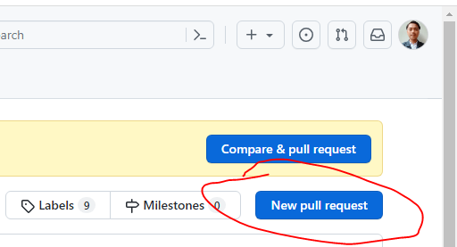

# Homepage WebDev Community

# Homepage WebDev Community

## Rules

- Frontend just work on Public and Views Folder
- Frontend work on index.ejs, login.ejs, register.ejs

## Requirement

- Nodejs
- npm
- mysql

## Running server

- Install npm

```
npm install
```

- Run server

```
npm run dev
```

## How to collaboarte

- Fork the community repository (https://github.com/Developers-Communit/homepage/tree/main)
  
- Lakukan perubahan sesuai dengan tugas anda

- Please use SECTION or DIV when work on html or .ejs file (examples)

```
<section id="aboutSection">
  ...
</section>

<div id="aboutSection">
</div>
```

- Please use Comment before yours css code(examples)

```
// CSS Style for About Section
#aboutSection{
  padding: 0;
  display: flex;
}
```

- Jika dirasa semua sudah selesai, silahkan lakukan Pull Request
  
